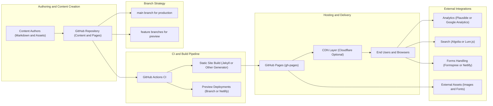

<head>
  <!-- Mermaid CDN (change version as desired) -->

</head>

# Architecture Overview

```mermaid
flowchart LR

  %% =========================
  %% Authoring Layer
  %% =========================
  subgraph Authoring["Authoring and Content Creation"]
    Author["Content Authors (Markdown and Assets)"]
    Repo["GitHub Repository (Content and Pages)"]
    Author --> Repo
  end

  %% =========================
  %% CI and Build Layer
  %% =========================
  subgraph CICD["CI and Build Pipeline"]
    CI["GitHub Actions CI"]
    Build["Static Site Build (Jekyll or Other Generator)"]
    Previews["Preview Deployments (Branch or Netlify)"]

    Repo --> CI
    CI --> Build
    CI --> Previews
  end

  %% =========================
  %% Hosting and Delivery
  %% =========================
  subgraph Hosting["Hosting and Delivery"]
    Pages["GitHub Pages (gh-pages)"]
    CDN["CDN Layer (Cloudflare Optional)"]
    Browser["End Users and Browsers"]

    Build --> Pages
    Pages --> CDN
    CDN --> Browser
  end

  %% =========================
  %% Integrations
  %% =========================
  subgraph Integrations["External Integrations"]
    Analytics["Analytics (Plausible or Google Analytics)"]
    Search["Search (Algolia or Lunr.js)"]
    Forms["Forms Handling (Formspree or Netlify)"]
    Assets["External Assets (Images and Fonts)"]
  end

  %% =========================
  %% Runtime Connections
  %% =========================
  Pages --> Assets
  Browser --> Analytics
  Browser --> Search
  Browser --> Forms

  %% =========================
  %% Branch Strategy (Docs Block)
  %% =========================
  subgraph Branching["Branch Strategy"]
    Main["main branch for production"]
    Feature["feature branches for preview"]
  end

  Repo --> Main
  Repo --> Feature
```
